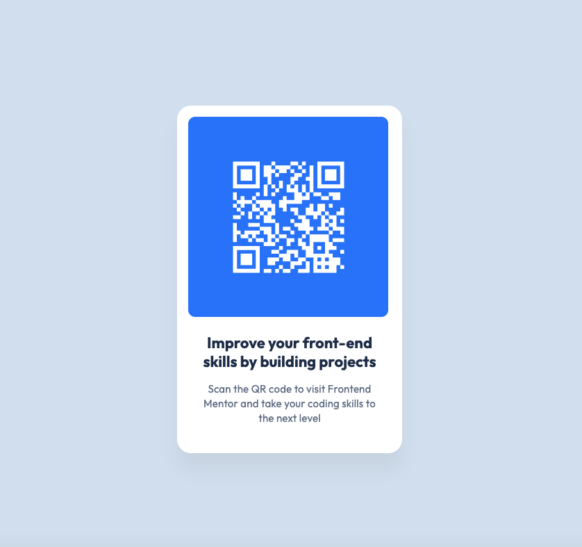

# Frontend Mentor - QR Code Component Solution

This is my solution to the [QR Code Component Challenge on Frontend Mentor](https://www.frontendmentor.io/challenges/qr-code-component-iux_sIO_H). Frontend Mentor challenges help developers improve their coding skills by building realistic projects.

## Table of Contents

- [Overview](#overview)
  - [Screenshot](#screenshot)
  - [Links](#links)
- [My Process](#my-process)
  - [Built With](#built-with)
  - [Useful Resources](#useful-resources)
  - [Author](#author)
  - [What I Learned](#what-i-learned)
  - [Continued Development](#continued-development)

## Overview

### Screenshot



### Links

- [Solution Repository](https://github.com/wiceldric75/qr-code-component-main) 
- [Live Demo](https://wiceldric75.github.io/qr-code-component-main/)

## My Process
    - Setup: Structured the project with semantic HTML5 and external CSS, importing the "Outfit" font via Google Fonts.
    - HTML: Created a clean, accessible layout using descriptive class names and logical content hierarchy.
    - CSS: Styled the component with custom properties, Flexbox for layout, and a mobile-first approach. Added box-shadow for depth and media   -- - queries for responsiveness.
    - Testing: Verified design accuracy and responsiveness across screen sizes.
    - Refinement: Iteratively adjusted spacing, font sizes, and alignment to match the mockup.

### Built With

- Semantic HTML5 markup
- CSS custom properties
- Flexbox
- Mobile-first workflow

### Useful Resources

- [CSS Tricks - Flexbox Guide](https://css-tricks.com/snippets/css/a-guide-to-flexbox/) - This guide was instrumental in helping me structure the layout of the QR code component effectively.
- [MDN Web Docs - Custom Properties](https://developer.mozilla.org/en-US/docs/Web/CSS/--*) - This resource provided detailed insights into using CSS custom properties for consistent styling.
- [Frontend Mentor Slack Community](https://www.frontendmentor.io/slack) - A supportive community where I asked questions and received valuable feedback during this challenge.

### Author
    - I have over 20 years of professional development experience, starting with a decade in embedded systems where I worked with assembly, C, and - C++. For the past 10+ years, I’ve specialized in iPhone application development using Objective-C and Swift. Recently, I’ve ventured into -- - starting my own business, which sparked my interest in web development. After spending months studying HTML, CSS, and JavaScript to build a - strong theoretical foundation, I’m now putting those skills into practice through hands-on challenges like those offered by Frontend Mentor.
    
- **GitHub**: [YourUsername](https://github.com/wiceldric75)
- **Frontend Mentor**: [@YourFrontendMentorUsername](https://www.frontendmentor.io/profile/wiceldric75)


### What I Learned

This challenge helped reinforce the importance of layout structure and reusable CSS properties. I practiced:
- Using **CSS custom properties** to maintain a consistent color palette and typography.
- Designing with a **mobile-first approach**, which makes the site responsive and ensures a good user experience on smaller devices.
- Implementing **box-shadow** for clean, modern card styling.

Here’s a snippet of CSS I’m particularly proud of:
```css
.card {
  display: flex;
  padding: var(--spacing-200, 16px) var(--spacing-200, 16px)
    var(--spacing-500, 40px) var(--spacing-200, 16px);
  flex-direction: column;
  align-items: flex-start;
  gap: var(--spacing-300, 24px);
  border-radius: 20px;
  background: var(--color-white, #fff);
  box-shadow: 0px 25px 25px 0px rgba(0, 0, 0, 0.05);
  margin-left: auto;
  margin-right: auto;
  width: 324px;
}
